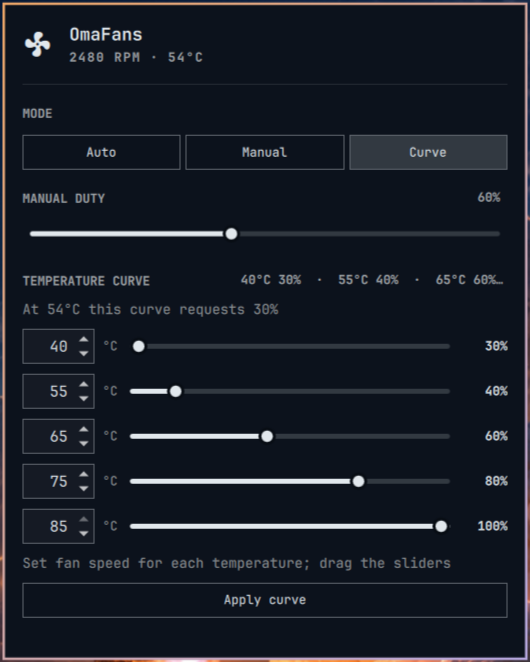

# OmaFans

[](https://github.com/thebytorsnowdog/omafans/actions/workflows/checks.yml)
[](LICENSE)

ThinkPad fan monitoring and control for the Omarchy 4 Quattro bar.

OmaFans keeps the fan's RPM, temperature and mode in the bar, with a popup for
firmware **Auto**, **Manual** duty and a five-point **Temperature curve**.
It follows the active Omarchy theme and supports keyboard navigation.



*Actual Omarchy panel with [fictional demo readings](demo/README.md).*

**Experimental, ThinkPad-specific software.** This is an independently
maintained community plugin, unaffiliated with Omarchy or Lenovo. It is not a
universal laptop fan controller. The daemon and widget are running on a
ThinkPad T480s, with real fan writes, heartbeat expiry, kernel watchdog firing
and service stop/restart checked. See the [measured hardware results](docs/hardware-validation.md).
Thermal stress, suspend/resume, reboot and other models remain untested.
Start with monitoring, review the code, and assess your hardware before enabling
control. See [verification scope](docs/SECURITY_REVIEW.md).

> [!WARNING]
> **Use at your own risk. No warranty** (see [LICENSE](LICENSE)).
> Fan control needs the `thinkpad_acpi fan_control=1` kernel option, which lets
> software override the firmware's own fan management. A wrong setting, bug or
> sensor fault can let the laptop **overheat**, throttle or suffer hardware damage.
> Control is tested only on a ThinkPad T480s. On that machine the kernel watchdog
> kept an already-selected level 7 when it expired, rather than switching to Auto.
>
> **Return to firmware Auto:** `sudo systemctl stop omafans.service` (the service
> releases control on stop). If the daemon is not responding, run
> `echo level auto | sudo tee /proc/acpi/ibm/fan`. To disable control completely, run
> `sudo /usr/bin/python3 -I scripts/setup.py remove` and reboot.

## Requirements

- Omarchy 4 Quattro with its `qs.Ui` and `qs.Commons` interfaces. Host validation
  targets Omarchy **4.0.4-1**; compatibility with other versions is unverified.
- Python **3.10+**, Linux with systemd, and a compatible ThinkPad exposing the
  modern `thinkpad_hwmon` device with `temp1_input`, `fan1_input`, `pwm1` and
  `pwm1_enable`.
- For control: `thinkpad_acpi fan_control=1`, a writable kernel `fan_watchdog`
  interface, and the separately installed root daemon.

The runtime uses only Python's standard library, Qt/Quickshell and the Omarchy
UI already installed on the host. There are no pip runtime dependencies,
online accounts, telemetry, HTTP listeners or runtime downloads.

## Supported hardware

| Model | Monitoring | Control | Notes |
| --- | --- | --- | --- |
| ThinkPad T480s | Tested | Tested (live writes, heartbeat expiry, watchdog, stop/restart) | [Results](docs/hardware-validation.md) |
| Other ThinkPads with `thinkpad_hwmon` (`temp1_input`, `fan1_input`, `pwm1`, `pwm1_enable`) | Expected | Untested | Reports welcome |
| Non-ThinkPad laptops | Not supported | Not supported | |

## Install the widget (monitoring first)

Review this repository, then add it using Omarchy:

```bash
omarchy plugin add https://github.com/thebytorsnowdog/omafans.git
omarchy plugin enable community.omafans --section right
```

The widget reads supported sensors without administrator privileges. It stays
in monitoring mode when its daemon is absent. Adding or enabling the plugin
does not install a service or enable kernel fan control.

## Optional fan control

Only one fan controller should run. Disable any existing controller before
starting OmaFans. The installer refuses installation while a known conflicting
service is active. Unknown controllers and firmware-specific behavior cannot
be detected reliably.

From the installed plugin directory, inspect `omafans.py`, `scripts/setup.py`
and `system/omafans.service`, then preview the installation:

```bash
cd ~/.config/omarchy/plugins/community.omafans
python3 scripts/setup.py install --user "$(id -un)" --dry-run
```

To install the root-owned daemon and opt into the kernel driver setting:

```bash
sudo /usr/bin/python3 -I scripts/setup.py install --user "$(id -un)" --enable-kernel-control
```

This enables the service for the next boot; it does not start it immediately.
Reboot to apply the kernel option. If fan control was already enabled, omit
`--enable-kernel-control` and explicitly start the installed service:

```bash
sudo systemctl start omafans.service
systemctl status omafans.service
```

The daemon authorizes exactly the desktop account chosen during installation.
There are no passwordless sudo rules, polkit grants or world-writable hardware
files. Installation records only the account's numeric UID and primary GID in
a private root-owned configuration on that machine.

## Use

Click the bar widget to open it. Choose Auto, Manual, or Curve. Manual targets
range from 30–100%; curve temperatures must rise from 30–85°C, percentages must
not decrease, and the final point must be 100%. Press **Apply curve** after
editing. In the popup, `A`, `M` and `C` select modes; arrow keys navigate.

ThinkPad firmware exposes discrete levels. OmaFans rounds a target up to the
next supported level; a 30% target can therefore read back as about 43%. The
bar's duty reading is the driver's reported level, not a measured fraction of
maximum RPM. The temperature curve is stepped, not interpolated.

Manual requests and curve edits live in daemon memory. Restarting the daemon
returns to Auto and the default curve. The widget sends a heartbeat every
three seconds; after a 15-second lapse, the next controller tick (within about
two seconds) returns to Auto. A later heartbeat does not resume an old manual
request. Closing the popup leaves control active; disabling the plugin stops
its heartbeat.

The daemon arms a 45-second kernel watchdog before every manual operation.
Its recovery is driver-specific: on the tested T480s, expiry preserved an
already-selected highest normal level 7 rather than switching it to Auto.
Invalid sensor data or a failed watchdog/write/read-back latches a fault and
attempts firmware Auto, with highest normal speed as a fallback. After that
attempt it stops making repeated writes so it cannot indefinitely postpone the
watchdog. Diagnose a fault before explicitly restarting the service. There is
no automatic daemon restart loop.

At `temp1_input >= 92°C`, the daemon requests the highest **normal** fan level
(255/level 7), even without a current heartbeat. This is not the driver's
disengaged/full-speed mode. Only `temp1_input` drives this safeguard: other
components, sensor mappings, fan failure and actual cooling effectiveness
are not monitored. No software safeguard guarantees adequate cooling.

For read-only diagnostics:

```bash
python3 fanctl.py status
omarchy-shell community.omafans.service status
```

IPC `set` returns `queued` when the helper has started; the following status
shows whether the daemon actually applied the setting.

## Update

```bash
omarchy plugin update community.omafans
```

The root-owned daemon is deliberately not updated by the shell plugin. After
reviewing changes, rerun the setup command without `--enable-kernel-control`,
then explicitly start `omafans.service`. The installer stops a running OmaFans
daemon before replacing it. A failed installation stays stopped for diagnosis.

## Remove

If the system component was installed, remove it **before** the plugin:

```bash
cd ~/.config/omarchy/plugins/community.omafans
sudo /usr/bin/python3 -I scripts/setup.py remove
omarchy plugin remove community.omafans
```

Removal stops the daemon, checks its reported stop result, removes the known
installed files, and reloads systemd. If shutdown fails, files remain for
recovery. Reboot after removal to clear any kernel option installed by OmaFans.
Removing only the widget leaves the separately installed service behind; the
missing heartbeat returns it to Auto.

Installed system files:

| Path | Purpose |
| --- | --- |
| `/usr/local/lib/omafans/omafans.py` | Root-owned controller code |
| `/etc/omafans/controller.json` | Mode 0600; authorized numeric UID/GID |
| `/etc/systemd/system/omafans.service` | Hardened system service |
| `/etc/modprobe.d/omafans.conf` | Only with explicit kernel opt-in |
| `/run/omafans/control.sock` | Ephemeral Unix socket managed by the service |

System journal records can remain under the machine's normal retention policy.
OmaFans does not persist user settings or credentials. It writes only the
ThinkPad PWM controls and watchdog at runtime. The QML service launches the
unprivileged Python helper; it never invokes privilege elevation.

## Troubleshooting

- **The widget shows monitoring only.** Either the daemon is not installed or running
  (`systemctl status omafans.service`), or `fan_control=1` is not active yet (reboot
  after `--enable-kernel-control`).
- **A 30% target reads about 43%.** That is expected. Firmware levels are discrete, so
  OmaFans rounds up to the next level.
- **The service reports a fault.** It has already tried to return to Auto and has stopped
  writing. Check `journalctl -u omafans.service`, then restart the service yourself.
- **The installer refuses to install.** Another fan controller (such as thinkfan or
  fancontrol) is active. Disable it first.

## Development and security

```bash
python3 -m unittest discover -s tests -v
python3 scripts/check_release.py
omarchy plugin validate .
```

The CI workflow also runs QML fixture tests, Bandit and Gitleaks against Git
history. Fixtures never write real hardware. See [SECURITY.md](SECURITY.md) for
the trust model and reporting procedure, and [docs/SECURITY_REVIEW.md](docs/SECURITY_REVIEW.md)
for tested scope and limitations. Scans are not a security certification.

The [MIT licence](LICENSE) covers this repository. Qt, Quickshell, Omarchy, Python and
Linux remain separate system dependencies under their respective licenses;
no copies of their source code are bundled.

Report compatibility and ordinary bugs through the repository's Issues tab, and see [CONTRIBUTING.md](CONTRIBUTING.md).
Before sharing diagnostics, remove usernames, home paths, serial numbers and
other identifying details.
